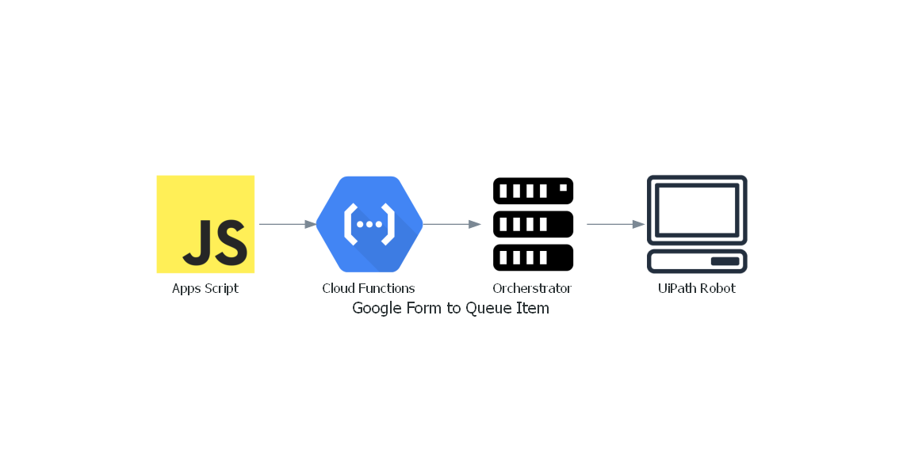

# FormToQueueItem

## Problem Space

How to bridge the gap between many people with data, and a centralize RPA system?  
This project shows how to leverage simple yet powerful and scalable SaaS and PaaS components to realize just that.

## Recipe

### Ingredients:

* **Google Forms**: data input from as many users as necessary, with flexible control on access permission and enterprise grade security
* **Google Cloud Functions**: to act as a serverless bridge between Google Forms and UiPath Cloud Orchestrator (GCP account with billing enabled required)
* **UiPath Cloud Platform**: we will leverage the community offering of Orchestrator as a Service for the sake of this demo
* **UiPath Studio and Robot**: because you probably want to do stuff with your data

### Data flow:

Users logged in with their Google account will access a form via a shared URL.  
In this form, they will enter some information.  
The Forms will be configured with a script in order to forward the data to the Cloud Functions instance (you may think of this setup as a form of webhook.)

The Cloud Functions instance will optionally transform the data, before forwarding it to the Cloud Orchestrator as a QueueItem.

Once the data reaches Orchestrator, we have several options to handle it from there, but we will assume that we want to process the data right away, so the incoming QueueItem will trigger an unattended process.

### Concrete example:

This is a fairly generic use case, that may be leveraged in a variety of scenarios, but in order to better illustrate the topic, we will implement a simple and specific application of a hypothetical user:

You are an internet service provider, and with so many people relying on their mobile phone for online access, things have been a bit slow during the recent years.  
But all of a sudden, everyone is now working from home, and the sales staff that you have posted in electronics stores are submitting thousands of applications in just a few days.  
This is a lot to process; much more than your current setup can handle, especially because the information is filled in paper forms and reaching you in the form of image data that needs to be input by hand.

From now, your customer facing staff will use tablets to input customer information directly into a Google Form, and a Robot will process it by sending a Confirmation email the customer, and recording the data into your company's ERP system.

This [_connector/solution_] uses the following Google services, subject to their specific license terms:  
Google Forms: [`Terms of Service`](https://policies.google.com/terms)  
Google Apps Script: [`Google API Terms of Service`](https://developers.google.com/terms) plus [`Google Apps Script Additional Terms`](https://developers.google.com/apps-script/terms)  
Google App Engine: [`Google Cloud Platform Terms of Service`](https://cloud.google.com/terms)

## Content

### :file_folder: `docs`

Some more detailed documentation about this project:  
:page_facing_up: [`Installation.md`](./docs/Installation.md): deployment instructions  
:page_facing_up: [`Remarks.md`](./docs/Remarks.md): Various comments about the design and implementation choices

### :file_folder: `function`

The source of the Google Cloud Functions instance.

### :file_folder: `script`

The source of the Apps Script to be used with your Google Forms.

### :file_folder: `workflow`

The of the UiPath workflow to be deployed on Orchestrator as unattended (Queue Trigger) process.
